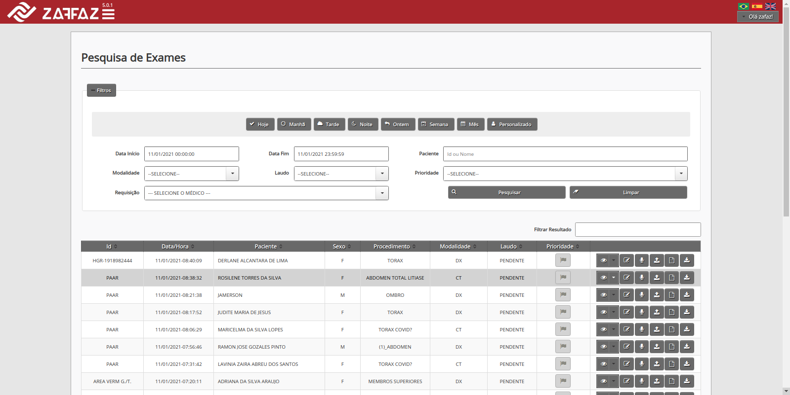
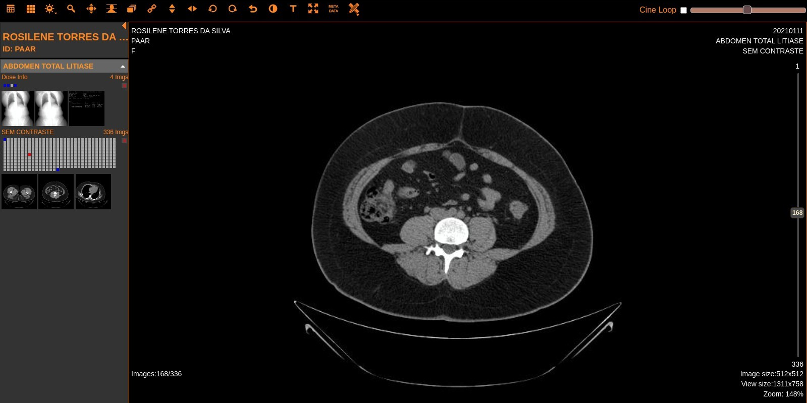
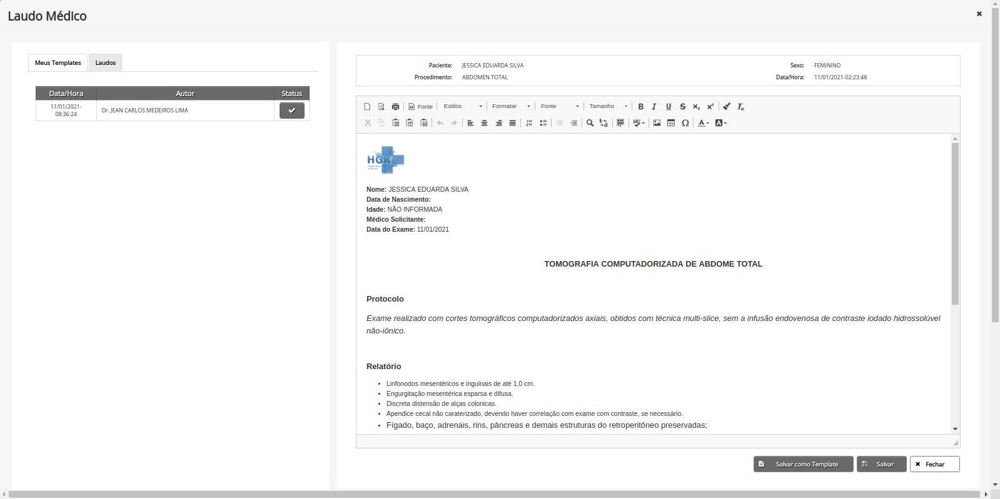
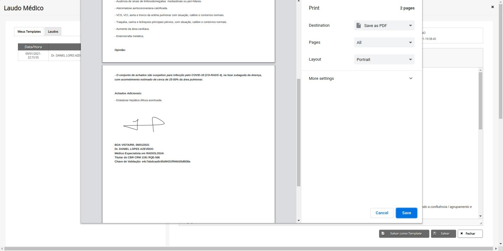

[

](images/logo_zafaz.png)

# Health

Sistema PACS (Picture Archiving and Communication System) com armazenamento e distribuição de imagens Radiológicas, fornecendo acesso externo (qualquer local com internet) para visualização das imagens e confecção de laudos médico.

### Features

- Multiplataforma, ou seja, funciona nos principais sistema operacionais do mercado, como Windows, Linux e MacOS
- Visualizador de exames médicos Web e desktop;
- Possibilidade de integração do sistemas de gestão hospitalar através de Web Service;
- Worklist para gestão de trabalho para equipamentos médicos;
- Versão mobile para acesso a imagens médicas por celulares e tablets.

### Screenshots

- Seu Funcionamento se da sob plataforma web e funciona nos principais navegadores do mercado como Firefox, Chrome, Internet Explore, Safari entre outros possui visualizador Desktop e funciona em qualquer sistema operacional do mercado como Linux, Windows e MacOS.

[

](images/studies.png)

- Através do ZAFAZ Health, o profissional médico pode visualizar as imagens médicas realizadas na unidade de saúde localmente ou em qualquer computador com acesso a internet, possuímos URLs personalizadas para cada unidade hospitalar com integração ao RIS e HIS.

[

](images/view.png)

- É integrado aos principais visualizadores de imagens medicas do mundo, possui lista de exames com seus filtros, e ferramentas como criador de notas de texto, notas de voz, editor de laudos e múltiplos visualizadores de imagens medicas.

[

](images/report.png)

- O sistema não faz alterações nas imagens e nem acréscimos é destinado exclusivamente ao armazenamento, distribuição, replicação e a segurança das informações bem como as funcionalidades necessárias para a confecção dos laudos médicos.

[

](images/print.png)

- Cada unidade de saúde possui um servidor de alto desempenho para arquivamento das imagens médicas no formato DICOM, para segurança dos dados, todas as imagens são replicadas para nossos servidores em nuvem.
